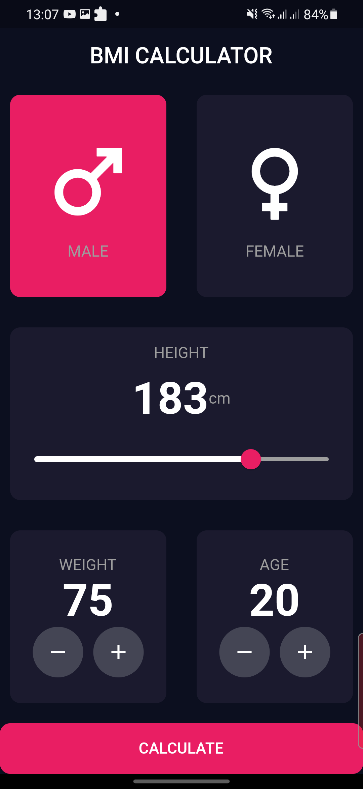
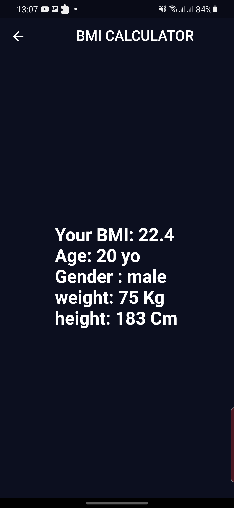

# bmicalculator

First flutter project

## Getting Started

This project is a starting point for a Flutter application.

 to run this app you need to :
      
       -clone this project on your machine by running: git clone TheUrlofthisrepository
       -run the app : flutter run

ScreenShots:
 Main screen:

 Result screen:

